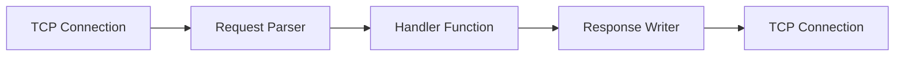

# TCP-to-HTTP

A custom HTTP/1.1 server implementation written in Go that handles HTTP requests over TCP connections from scratch, without relying on the standard `net/http` server package.

## Overview

This project implements a low-level HTTP server that parses HTTP requests directly from TCP streams and constructs HTTP responses manually. It demonstrates fundamental HTTP protocol handling including request parsing, header management, and response writing. [1](#0-0) 

## Features

- **Custom HTTP/1.1 Parser**: Parses HTTP requests from raw TCP byte streams
- **Header Management**: Full HTTP header parsing and manipulation with case-insensitive handling
- **Request Body Support**: Handles request bodies with Content-Length header
- **Chunked Transfer Encoding**: Supports chunked response encoding with trailers
- **Multiple Endpoints**: Includes demo endpoints with different response types
- **Concurrent Connections**: Handles multiple simultaneous client connections using goroutines [2](#0-1) 

## Architecture

### Core Components

The project is organized into the following modules:

1. **Server** (`internal/server/`): TCP listener and connection handler
2. **Request Parser** (`internal/requests/`): HTTP request parsing state machine
3. **Response Writer** (`internal/response/`): HTTP response construction
4. **Headers** (`internal/headers/`): HTTP header parsing and management [3](#0-2) 

### Request Processing Flow



## Installation

```bash
# Clone the repository
git clone https://github.com/XxFiEnDxX/TCP-to-HTTP.git
cd TCP-to-HTTP

# Run the HTTP server
go run cmd/httpServer/main.go
```

## Usage

### Running the HTTP Server

The main HTTP server runs on port 42069: [4](#0-3) [5](#0-4) 

### Available Endpoints

The demo server provides several test endpoints:

- **`/`** - Returns a 200 OK success page
- **`/yourproblem`** - Returns a 400 Bad Request error
- **`/myproblem`** - Returns a 500 Internal Server Error
- **`/video`** - Serves a video file with appropriate content-type
- **`/httpbin/*`** - Proxies requests to httpbin.org with chunked transfer encoding [6](#0-5) 

### Testing Tools

#### TCP Listener

A TCP listener utility for debugging HTTP requests (runs on port 42068): [7](#0-6) 

#### UDP Listener

A UDP client for testing UDP communication: [8](#0-7) 

## Project Structure

```
TCP-to-HTTP/
├── cmd/
│   ├── httpServer/    # Main HTTP server application
│   ├── tcplistener/   # TCP debugging tool
│   └── udplistener/   # UDP testing client
└── internal/
    ├── headers/       # HTTP header parsing and management
    ├── requests/      # HTTP request parser
    ├── response/      # HTTP response writer
    └── server/        # TCP server and connection handler
```

## Implementation Details

### Request Parsing

The request parser implements a state machine with the following states:
- `StateInit`: Initial state, parsing request line
- `StateHeader`: Parsing headers
- `StateBody`: Reading request body
- `StateDone`: Parsing complete [9](#0-8) 

### Response Status Codes

Supported HTTP status codes:
- 200 OK
- 400 Bad Request
- 500 Internal Server Error [10](#0-9) 

### Chunked Transfer Encoding

The server supports HTTP chunked transfer encoding with trailer headers, demonstrated in the `/httpbin/*` endpoint which streams responses in 32-byte chunks and includes SHA-256 checksum and content length in the trailers. [11](#0-10) 

## Notes

- This is an educational/demonstration project showing how HTTP servers work at a low level
- The server currently only supports HTTP/1.1
- Chunked request encoding is not yet implemented (only chunked responses)
- The server uses graceful shutdown handling with signal interrupts
- All header names are normalized to lowercase for case-insensitive comparison

### Citations

**File:** internal/server/server.go (L50-62)
```go
func Serve(port uint16, handler Handler) (*Server, error) {
	listener, err := net.Listen("tcp", fmt.Sprintf(":%d", port))
	if err != nil {
		return nil, err
	}
	server := &Server{
		closed:  false,
		handler: handler,
	}
	go runServer(server, listener)

	return server, nil
}
```

**File:** internal/requests/request.go (L12-20)
```go
type parseState string

const (
	StateInit   parseState = "init"
	StateHeader parseState = "headers"
	StateBody   parseState = "body"
	StateDone   parseState = "done"
	StateError  parseState = "error"
)
```

**File:** internal/requests/request.go (L164-185)
```go
func RequestFromReader(reader io.Reader) (*Request, error) {
	request := newRequest()

	buf := make([]byte, 1024)
	bufLen := 0
	for !request.done() {
		n, err := reader.Read(buf[bufLen:])
		if err != nil {
			return nil, err
		}

		bufLen += n
		readN, err := request.parse(buf[:bufLen])
		if err != nil {
			return nil, err
		}

		copy(buf, buf[readN:bufLen])
		bufLen -= readN
	}
	return request, nil
}
```

**File:** internal/headers/headers.go (L56-94)
```go
type Headers struct {
	headers map[string]string
}

func NewHeaders() *Headers {
	return &Headers{
		headers: map[string]string{},
	}
}

func (h *Headers) Get(name string) (string, bool) {
	str, ok := h.headers[strings.ToLower(name)]
	return str, ok
}

func (h *Headers) Replace(name, value string) {
	name = strings.ToLower(name)
	h.headers[name] = value
}

func (h *Headers) Delete(name string) {
	name = strings.ToLower(name)
	delete(h.headers, name)
}

func (h *Headers) Set(name, value string) {
	name = strings.ToLower(name)
	if v, ok := h.headers[name]; ok {
		h.headers[name] = fmt.Sprintf("%s,%s", v, value)
	} else {
		h.headers[name] = value
	}
}

func (h *Headers) ForEach(cb func(n, v string)) {
	for n, v := range h.headers {
		cb(n, v)
	}
}
```

**File:** cmd/httpServer/main.go (L19-19)
```go
const port = 42069
```

**File:** cmd/httpServer/main.go (L74-130)
```go
		if req.RequestLine.RequestTarget == "/yourproblem" {
			body = response400()
			status = response.StatusBadRequest
		} else if req.RequestLine.RequestTarget == "/myproblem" {
			body = response500()
			status = response.StatusInternalServeError
		} else if req.RequestLine.RequestTarget == "/video" {
			f, _ := os.ReadFile("assets/vim.mp4")
			h.Replace("content-type", "video/mp4")
			h.Replace("content-length", fmt.Sprintf("%d", len(f)))

			w.WriteStatusLine(response.StatusOK)
			w.WriteHeaders(*h)
			w.WriteBody(f)

			return
		} else if strings.HasPrefix(req.RequestLine.RequestTarget, "/httpbin/") {
			target := req.RequestLine.RequestTarget
			res, err := http.Get("https://httpbin.org/" + target[len("/httpbin/"):])

			// res, err := http.Get("https://httpbin.org/stream/2")
			if err != nil {
				body = response500()
				status = response.StatusInternalServeError
			} else {
				w.WriteStatusLine(response.StatusOK)

				h.Delete("Content-length")
				h.Set("transfer-encoding", "chunked")
				h.Replace("Content-Type", "text/plain")
				h.Set("Trailer", "X-Content-SHA256")
				h.Set("Trailer", "X-Content-Length ")
				w.WriteHeaders(*h)

				fullBody := []byte{}

				for {
					data := make([]byte, 32)
					n, err := res.Body.Read(data)
					if err != nil {
						break
					}

					fullBody = append(fullBody, data[:n]...)
					w.WriteBody([]byte(fmt.Sprintf("%x\r\n", n)))
					w.WriteBody(data[:n])
					w.WriteBody([]byte("\r\n"))
				}
				w.WriteBody([]byte("0\r\n"))
				tailers := headers.NewHeaders()
				out := sha256.Sum256(fullBody)
				tailers.Set("X-Content-SHA256", toStr(out[:]))
				tailers.Set("X-Content-Length", fmt.Sprintf("%d", len(fullBody)))
				w.WriteHeaders(*tailers)
				return
			}
		}
```

**File:** cmd/httpServer/main.go (L143-143)
```go
	log.Println("Server started on port", port)
```

**File:** cmd/tcplistener/main.go (L17-44)
```go
	listener, err := net.Listen("tcp", ":42068")

	if err != nil {
		log.Fatal("Error", "Error", err)
	}

	for {
		conn, err := listener.Accept()
		if err != nil {
			log.Fatal("Error", "Error", err)
		}

		r, err := request.RequestFromReader(conn)
		if err != nil {
			log.Fatal("Error", "Error", err)
		}

		fmt.Printf("Request line: \n")
		fmt.Printf("- Method: %s\n", r.RequestLine.Method)
		fmt.Printf("- Target: %s\n", r.RequestLine.RequestTarget)
		fmt.Printf("- Version: %s\n", r.RequestLine.HttpVersion)
		fmt.Printf("Headers: \n")
		r.Headers.ForEach(func(n, v string) {
			fmt.Printf("- %s: %s\n", n, v)
		})
		fmt.Printf("Body: \n")
		fmt.Printf("%s \n", r.Body)
	}
```

**File:** cmd/udplistener/main.go (L10-26)
```go
func main() {
	serverAddr := "localhost:42069"

	udpAddr, err := net.ResolveUDPAddr("udp", serverAddr)
	if err != nil {
		fmt.Fprintf(os.Stderr, "Error resolving UDP address: %v\n", err)
		os.Exit(1)
	}

	conn, err := net.DialUDP("udp", nil, udpAddr)
	if err != nil {
		fmt.Fprintf(os.Stderr, "Error dialing UDP: %v\n", err)
		os.Exit(1)
	}
	defer conn.Close()

	fmt.Printf("Sending to %s. Type your message and press Enter to send. Press Ctrl+C to exit.\n", serverAddr)
```

**File:** internal/response/response.go (L16-20)
```go
const (
	StatusOK                 StatusCode = 200
	StatusBadRequest         StatusCode = 400
	StatusInternalServeError StatusCode = 500
)
```
